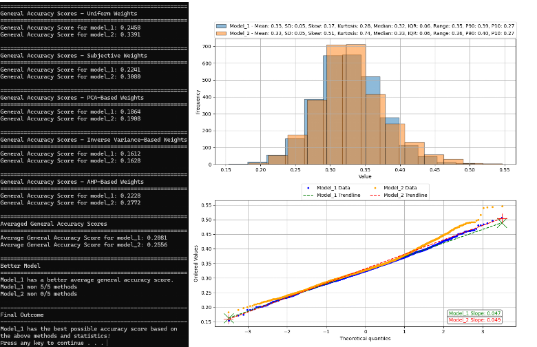

# Bulk-FaceDistance-Statistics

¡Please check the USAGE section for instructions on a worked example, with included example data sets, to showcase the script's capabilities! :)

A Python script I designed to help me analyze large datasets of face-distance similarity metrics, determining generalized accuracy scores based on various statistical methods. This script evaluates two folders of facial recognition data, contained as lists of values (e.g. \[1,2,3,...\]) for each image, in TXT files, and calculates multiple statistical metrics and visualizes the results. The intention is to use the script to compare two Stable Diffusion models by analyzing the L2_Norm, Eucliddeon, and/or Cosine distances (one-type at a time, L2_Norm used in example data) of large sets of randomly generated images against a finite set of reference images of the trained subject. Such a comparison can be crucial in determining the effect of a single change in training methodology and its overall effect on model output; for example, seeing the effect of changing the Loss Weight function between 'Constant' and 'Min_SNR_Gamma' on what is otherwise the same dataset and hyperparameters. Ultimately, the success of a model is determined by its ability to reliably reproduce the likeness of the trained subject, and this script is my first attempt to quantitatively address issues related to that.

An example of one way to generate face-distance similarity data (the way I did it) is to use the following ComfyUI custom node, [here](https://github.com/cubiq/ComfyUI_FaceAnalysis).
This node will automatically output the data in the required list format, and my script was initially designed with its use in mind. Those who do not want to use ComfyUI can look into generating this data another way via the [DLib](http://dlib.net/) and/or [InsightFace](https://github.com/deepinsight/insightface) libraries.

Built with the help of GPT-4o; thanks Zedd! (>'.')>[<3] 

Feel free to use, share, and modify this script to suit your needs.
Made "for fun", and shared completely for free for those who love GenAI too.
<(˶ᵔᵕᵔ˶)>



## Table of Contents

- [Changelog](#changelog)
- [Installation](#installation)
- [Usage](#usage)
- [Contributing](#contributing)
- [License](#license)
- [Acknowledgments](#acknowledgments)

## Changelog

### [1.0] - 7/23/2024
_First release._

## Installation

1. Please have Python 3.7, or later, installed. You can download it from [python.org](https://www.python.org/downloads/).

2. Clone the repository and go into the created folder:
    ```sh
    git clone https://github.com/your-username/Bulk-FaceDistance-Statistics.git
    cd Bulk-FaceDistance-Statistics
    ```

3. Install the required dependencies:
    ```sh
    pip install numpy matplotlib scipy scikit-learn
    ```
    or
    ```sh
    pip install -r requirements.txt
    ```
    
## Usage

To use the script and analyze the face-distance data, follow these steps:

1. Update the USER DEFINED variables at the top of the script:
    - Change `dir_model_1` and `dir_model_2` to the paths of your dataset folders containing the face-data TXT files.
        * e.g., `dir_model_1 = r"C:\path\to\dataset1"`
        * e.g., `dir_model_2 = r"C:\path\to\dataset2"`
        * Keep in mind that the script can handle single or multple TXT files in each directory (so long as the data is formatted correctly in each). The script will then combine all data from the TXT files into a single dataset, for each directory, before analysis. In this way large image sets can have their distance data generated in batchs, and the script will automatically combine the resulting set of TXT files.
        * Keep in mind that the script expects the face-distance similarity metric values to be given within a range from \[0-1\]. Any data that is outside this range will be treated as an outlier and excluded from any subsequent calculations in the script.

2. Run the script:
    - Double-click the, `bulk_facedistance_statistics.py`
   or
    - Use the included BAT, `run_bulk_facedistance_statistics.bat`
        * Terminal output shwowing the statistical results may not remain open unless you use the BAT.
        * Terminal output is also written to a `output_stats.txt` file in the same directory as the script, see provided example file for details.

3. The script will then proceed to down the following list of tasks:
    - Calculates 9 statistical metrics, i.e. `metric_names = ["Mean", "SD", "Median", "IQR", "Skewness", "Kurtosis", "Range", "P90", "P10"]`, using the data distributions formed by the TXT files.
    These are the Mean, Standard Deviation, Median, Interquartile Range, Skewness, Excess Kurtosis, Range, 90th-Percentile, and 10th-Percentile. This was done as a naive attempt to create a genealized score for any (reasonable) dataset that could be created using a Stable Diffusion model, and to account for any number of possible distribution shapes. The most important metrics seems to be the first two, by far, after testing the script on 600+ generated images selected in random batches of 200 (ignoring remainders).
    - Uses the metrics in 5 statistical weighting shcemes, which are, `Uniform, Subjective, PCA-Based, Inverse-Variance Based, and AHP-Based` as a naive attempt to combine the various metrics into a so-called, "General Accuracy Score". This score is then averaged via a simple mean to get the overall accuracy score. The final outcome is determined by i. which model has the better average score (smaller is better), ii. which model won more individual method-based accuracy scores, and iii. whether or not either model succeeded in both tests.
        * When compared to a simple visual inspection of the images, I find it hard to disagree with the test when a model succeeds at both checks.
    - Logs the output results to a `output_stats.txt` file, which is generated in the same folder/directory as the script itself, as well as displayed in the CMD line terminal window.
    - Two graphs are created, i. An overlapped histogram of the two data distributions, and ii. A Q-Q plot, useful for quickly telling at a glance if the distributions are Gaussian (normal).
        * The script contains additional logic for comparing the data set distributions to corresponding normal distrubtions, which are created synthetically using the calculated Mean and SD of the data distribtuions.
        * This is done by a basic 1:1 comparison of data and syntheic metric values via absolute percent differences, and then the more rigorous Shapiro-Wilk Test for normality.
        * I was interested in tesing the Central Limit Theorem (CLT) using this Gaussian logic, i.e. the data distributions should become more Gaussian as you include more randomly sourced data points.

4. \[EXAMPLE\] Please follow these steps to replicate the example output TXT file and the example graph:
    - The `Example_Data_Directories.zip` contains two folders, `data_model_1` and `data_model_2`, each with TXT files containing L2_Norm similarity metric data. Within each folder, there are various TXT files, labled like `a1_H.txt` and an `extras` folder. The TXT files represent face-distance data gained from 5 reference images of the main subject (i.e. a,b,g,n,z), from 3 batches that were randomly sorted from the total 600+ image data (i.e. 1,2,3), and from two seperate Stable Diffusion models trained on the same dataset (i.e. H and not). The only difference between these two models is that 'H' used the Min_SNR_Gamma Loss Weight function (e.g. see [OneTrainer GUI](https://github.com/Nerogar/OneTrainer)) and 'not' used the defualt Constant function. All other hyperparamters were left the same between the two.
    - Run the script by first setting the script's directory variables to where you placed the example directories and using the included BAT:
        * e.g., `dir_model_1 = r"C:\path\to\data_model_1"`
        * e.g., `dir_model_2 = r"C:\path\to\data_model_2"`
        * The script should then replicate the example output and graph seen in the repo!
    - Experiment with moving different TXT files from each data set into the `extras` folder of each directory (which the script ignores) and see the effect on the resulting graphs and calculations!

## Contributing

Contributions are welcome! If you have any suggestions, improvements, or bug fixes, please follow these steps:

1. Fork the repository.
2. Create a new branch with a descriptive name (`git checkout -b my-feature-branch`).
3. Make your changes and commit them (`git commit -m 'Add some feature'`).
4. Push to the branch (`git push origin my-feature-branch`).
5. Open a pull request.

Please ensure your code adheres to the existing style and includes appropriate tests.

### Reporting Issues

If you find a bug or have a feature request, please create an issue [here](https://github.com/klromans557/Bulk-FaceDistance-Statistics/issues).

## License

This project is licensed under the MIT License - see the [LICENSE](LICENSE) file for details.

## Acknowledgments

- [Matteo Spinelli](https://github.com/cubiq/ComfyUI_FaceAnalysis) for creating the ComfyUI custom node that I used to generate the similairy metric data for each model.
- [OpenAI](https://www.openai.com) for providing guidance and assistance in developing this project.
- [GitHub](https://github.com) for hosting the repository.
- [Dr. Furkan Gözükara](https://www.patreon.com/SECourses/posts) for sharing his scripts through the SECourses Patreon, associated Discord server and YouTube channel.
  These resources were invaluable to me during the development of this project and served as guides/templates for creating such scripts.
